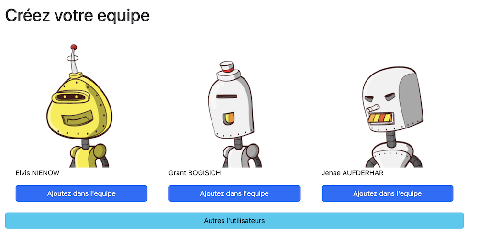
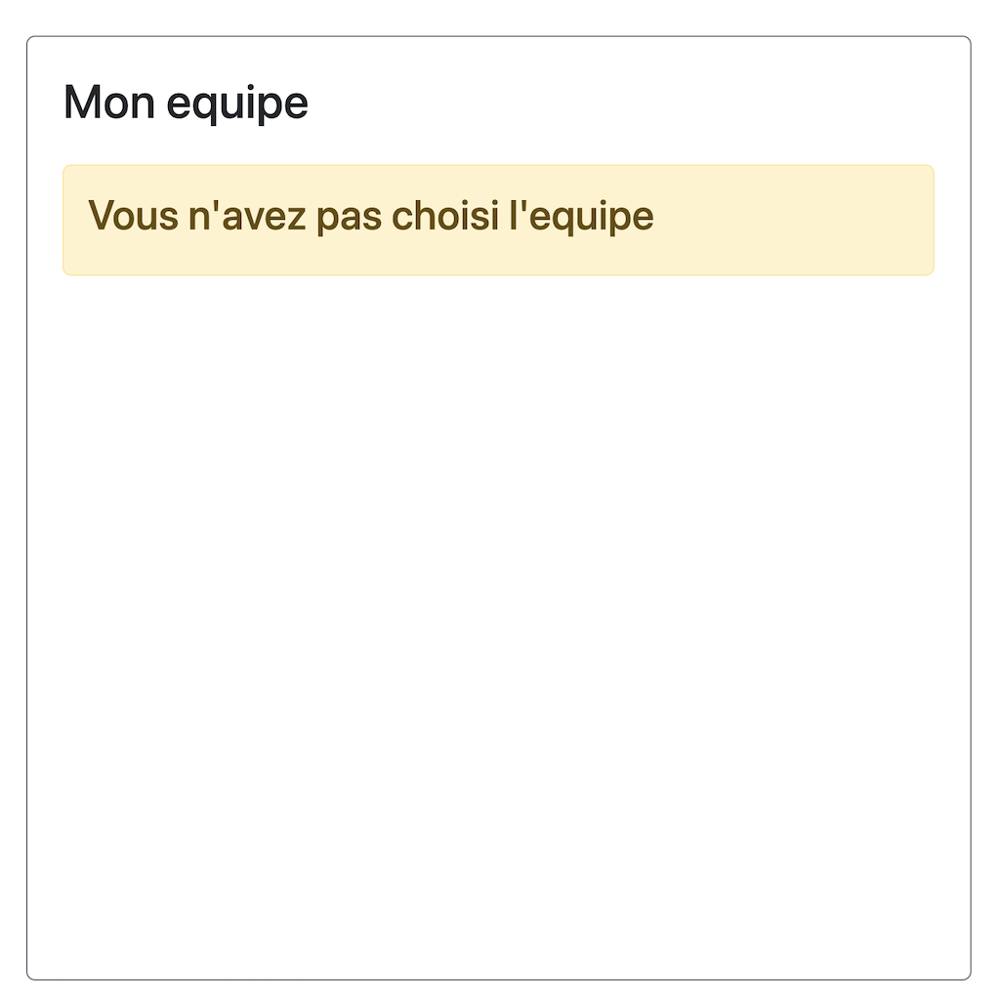
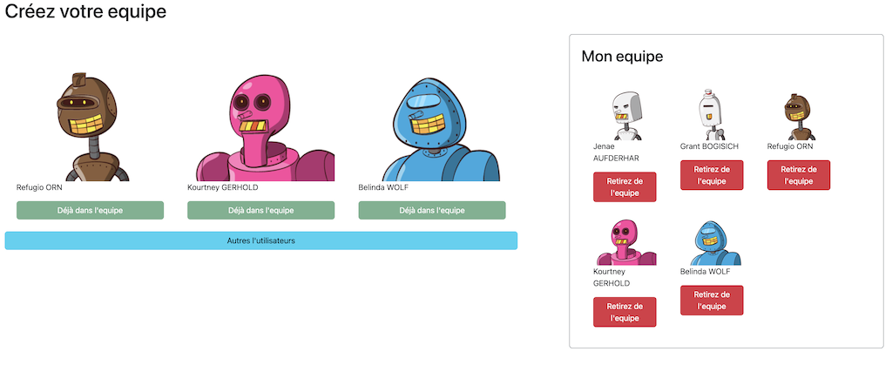
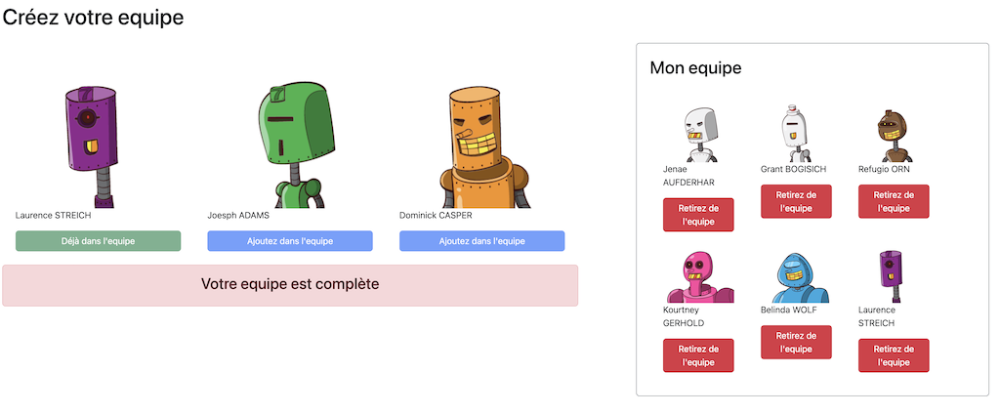

# Le projet pédagogique : "Team Builder"

## Les caractéristiques

- une liste de l'utilisateurs reçu via API `https://random-data-api.com/` ;
- il est possible d'ajouter l'utilisateur vers l'equipe ;
- il est possible de suppromer l'utilisateur de l'equipe ;
- il est possible de changer de la list de l'utilisateurs ;
- des differents alertes.

## Utilisation

Afin d'exécuter ce projet localement il faut :

- installer toutes les dependances à la racine du projet

```bash
    npm install
```

- démarrer le serveur et aller sur l'url `http://localhost:4200/`

```bash
    ng serve
```

## La Stack Technique

**Client :** Angular, HTML5, CSS3

## Screenshots
### --------------------- Une liste de l'utilisateurs / Users list ---------------------

### --------------------- Une l'equipe vide / Empty team ---------------------

### --------------------- Une l'equipe avec l'utilisateurs / The team with users ---------------------

### --------------------- L'equipe est complète / Team fullfilled ---------------------



### --------------------- English version ---------------------

# The educational project: “Team Builder”

## Characteristics

- a list of users received via API `https://random-data-api.com/`;
- it is possible to add the user to the team;
- it is possible to remove the user from the team;
- it is possible to change the user list;
- different alerts.

## Hot to use

In order to execute this project locally you must:

- install all dependencies at the root of the project and navigate to `http://localhost:4200/`

```bash
     npm install
```

- start the server

```bash
     ng serve
```

## Tech Stack

**Client:** Angular, HTML5, CSS3